# The BACK Stack Architecture

In the cloud-native world, the hub-and-spoke architecture presents an intriguing prospect. This design pattern capitalizes on Kubernetes's inherent elasticity and scalability, thereby enabling a host of unique benefits for development, deployment, and data management.

## Hub-and-Spoke

Imagine a central data platform residing in the Kubernetes cluster, acting as the "hub." This hub is the single source of truth, providing foundational data and services to surrounding applications, the "spokes." For example, these spokes are microservices deployed within a Kubernetes cluster, focusing on some specific functionalities.

### Benefits

-  **Loose Coupling and Agility:** Spokes are developed and deployed autonomously, enabling rapid iteration and independent scaling. This fosters modularity and faster time-to-market for new features.
-  **Data Consistency and Governance:** The centralized hub ensures data integrity and consistency across all spokes. Access control and security policies can be applied centrally, simplifying management.
-  **Scalability and Elasticity:** Both the hub and spokes leverage Kubernetes' inherent scaling capabilities. Resources can be dynamically adjusted based on demand, optimizing resource utilization and cost.
-  **Cloud-Native Advantages:** Seamless integration with cloud provider services expands development possibilities.

## How does it all fit together?

